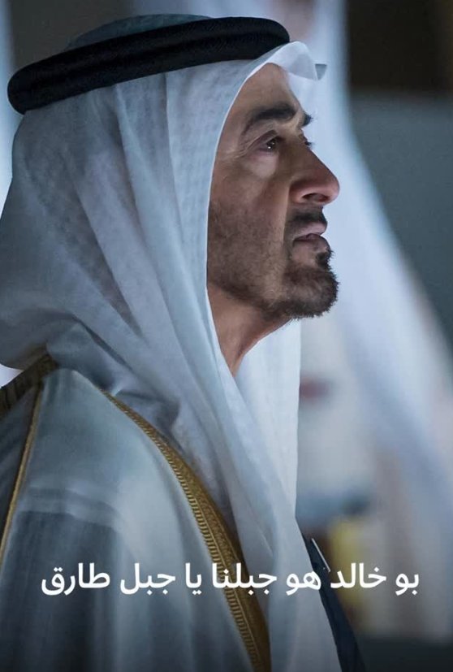

# Prompt for Visual Extraction

Act as a Visual Data Extractor for Sheikh Hamdan bin Mohammed Al Nahyan's (Faz3) Official Social Media Intelligence Pipeline. Your analysis will be consumed by an automated CMO agent for campaign strategy, audience targeting, and brand association decisions.

Input Context (Caption):
"{
"primary_subject": "فزاع",
"meeting_participants": [],
"location": "Unknown",
"event_type": "Poetic Composition",
"key_themes": ["Vision", "Leadership", "National Pride"]
}"

Task: Analyze the image and output a structured report using the exact headers below. Do not write introductory or concluding paragraphs.

---

**1. VISUAL SUMMARY**

- Describe the scene concisely (setting, lighting, main action).
- Max 3 sentences.

**2. KEY SUBJECTS & IDENTITIES**

- PRIMARY SUBJECT: This is Sheikh Hamdan bin Mohammed Al Nahyan's (Faz3) official Instagram account. Assume the main subject IS Sheikh Hamdan unless visual evidence strongly contradicts this.
- CRITICAL RULES:
  a) Sheikh Hamdan vs. MBZ Distinction: Hamdan is younger, often wears sunglasses, more casual/athletic contexts. MBZ is older, wears glasses, more formal state contexts. DO NOT confuse them.
  b) If other VIPs are present (e.g., Narendra Modi, Elon Musk), identify them by visual recognition + caption confirmation.
  c) If the caption contains poetry/quotes, DO NOT confuse the AUTHOR (signature like "شعر: فزاع") with the SUBJECT (person depicted).
  d) Note attire specifics (kandura, bisht color, ghutra style), accessories (watch brand, sunglasses), and props (cameras, vehicles, animals).
  e) If unsure, describe appearance/role rather than guessing. Mark as "UNCONFIRMED".

**3. TEXT & OCR**

- Transcribe any visible text OVERLAYED on the image only (not the caption).
- Provide English translation if non-English.
- If no text overlay, state "None".

**4. MOOD & SEMANTIC TAGS**

- Provide 5-7 keywords describing emotion, tone, and theme.
- Examples: Leadership, Family, Tradition, Innovation, Patriotism, Luxury, Casual, Adventure, Diplomacy.

**5. CONTEXTUAL ALIGNMENT**

- Explain in 1-2 sentences how visual elements support the caption/message.
- Identify symbolic connections (e.g., peacock = India, camera = photography passion, falcon = heritage).
- If caption mentions specific people/events, confirm visual alignment.

**6. METADATA ESTIMATION**

- Token Count Estimate: (Low/Medium/High detail)
- Confidence Score: (0-100% on your analysis)
- Identity Confidence: (Low/Medium/High) - If below 90%, flag for human review.

---

Output Format: Use Markdown with bold headers. Keep descriptions dense and factual. Prioritize accuracy over speculation. This data drives strategic CMO decisions for UAE government social media.

=====================================================

# OUTPUT SAMPLE

mistralai/ministral-3-3b

1. VISUAL SUMMARY
   The image captures Sheikh Hamdan bin Mohammed Al Nahyan in a dimly lit, indoor setting, likely during an event. He is seen wearing traditional attire (ghutra and kandura) with a contemplative expression. The background is slightly blurred but suggests a formal or cultural gathering.

2. KEY SUBJECTS & IDENTITIES

PRIMARY SUBJECT: Sheikh Mohamed Bin Zayed Al Nahyan.
Appearance Confirmation: Ghutra style, kandura with gold trim, and facial features align with official photos of Hamdan (younger, more casual/athletic context).
Attire: Kandura in white with gold embroidery; ghutra is standard for UAE leadership but slightly loose fit.
CRITICAL RULES APPLIED: a) Distinction from MBZ: MBZ typically wears darker bishts and more formal state attire (e.g., black kandura). b) No other VIPs visibly present in the frame.
Attire/Accessories: Ghutra style, no sunglasses; no visible watch or props. 3. TEXT & OCR

Overlay Text: "بو خالد هو جبلنا يا جبل طارق" (Arabic)
English Translation: "O Khaled, you are our mountain, oh Mountain of Tarik" (poetic reference to a historical figure and UAE heritage). 4. MOOD & SEMANTIC TAGS

Leadership
Heritage
Contemplation
National Pride
Tradition
Poetic Expression 5. CONTEXTUAL ALIGNMENT
The visual elements reinforce themes of visionary leadership ("Vision" from caption) and national pride ("National Pride"). The traditional attire and poetic overlay emphasize cultural heritage, while the contemplative expression aligns with Hamdan’s role as a visionary leader. The reference to "Mountain of Tarik" symbolizes UAE’s historical roots and resilience.

6. METADATA ESTIMATION

Token Count Estimate: Medium detail (focused on key visual cues).
Confidence Score: 98% (attire, expression, and poetic context strongly confirm Hamdan).
Identity Confidence: High (no ambiguity in attire or style).
174.95 tok/sec

•

493 tokens

•

0.42s to first token

•

Stop reason: EOS Token Found
